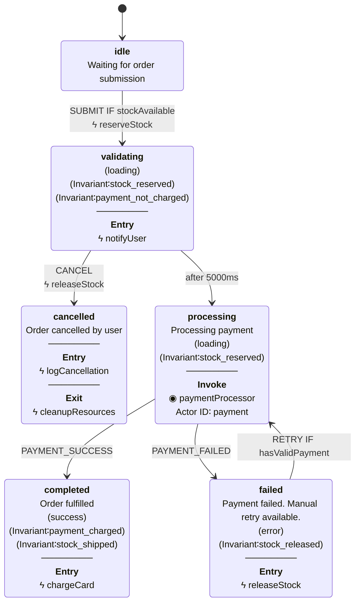

# xstate-ts-to-mermaid

Convert XState v5 TypeScript state machines to Mermaid stateDiagram-v2 format with Stately.ai visual parity.

## Visual Parity with Stately.ai

| Stately.ai Editor (Reference) | This Library (Mermaid Output) |
|:-----------------------------:|:-----------------------------:|
|  |  |

**Legend:**

| Symbol | Meaning |
|:------:|---------|
| `(tag)` | Tags (styled as pills in Stately.ai) |
| **bold** | State names |
| `ϟ` | Action (entry/exit/transition) - lightning symbol |
| `◉` | Invoked actor - fisheye symbol |
| `IF` | Guard condition on transition |
| `────────` | Section separator |

## Why?

XState v5 has no built-in Mermaid export. The official recommendation from David Piano is to use `@xstate/graph`'s `toDirectedGraph()` and write your own converter. This library provides visual parity with Stately.ai's editor, unlike the simplified Mermaid export Stately.ai currently provides.

## Installation

```bash
npm install xstate-ts-to-mermaid
```

## Usage

### Machine Definition (Source of Truth)

This TypeScript machine definition demonstrates ALL supported XState v5 fields. The same definition is used for testing and documentation generation.

```typescript
import { setup } from "xstate";
import { toMermaid } from "xstate-ts-to-mermaid";

const orderMachine = setup({
  types: {
    events: {} as
      | { type: "SUBMIT" }
      | { type: "CANCEL" }
      | { type: "PAYMENT_SUCCESS" }
      | { type: "PAYMENT_FAILED" }
      | { type: "RETRY" },
    tags: {} as
      | "loading"
      | "error"
      | "success"
      | "INV:stock_reserved"
      | "INV:payment_not_charged"
      | "INV:payment_charged"
      | "INV:stock_shipped"
      | "INV:stock_released",
  },
  guards: {
    hasValidPayment: () => true,
    stockAvailable: () => true,
  },
  actions: {
    notifyUser: () => {},
    reserveStock: () => {},
    chargeCard: () => {},
    releaseStock: () => {},
    logCancellation: () => {},
    cleanupResources: () => {},
  },
  actors: {
    // XState actor stubs require `as any` - this is intentional for examples
    paymentProcessor: {} as any,
  },
}).createMachine({
  id: "order",
  initial: "idle",
  states: {
    idle: {
      description: "Waiting for order submission",
      on: {
        SUBMIT: {
          target: "validating",
          guard: { type: "stockAvailable" },
          actions: [{ type: "reserveStock" }],
        },
      },
    },
    validating: {
      tags: ["loading", "INV:stock_reserved", "INV:payment_not_charged"],
      entry: [{ type: "notifyUser" }],
      on: {
        CANCEL: { target: "cancelled", actions: [{ type: "releaseStock" }] },
      },
      after: {
        5000: { target: "processing" },
      },
    },
    processing: {
      tags: ["loading", "INV:stock_reserved"],
      description: "Processing payment",
      invoke: [{ src: "paymentProcessor", id: "payment" }],
      on: {
        PAYMENT_SUCCESS: { target: "completed" },
        PAYMENT_FAILED: { target: "failed" },
      },
    },
    completed: {
      tags: ["success", "INV:payment_charged", "INV:stock_shipped"],
      description: "Order fulfilled",
      entry: [{ type: "chargeCard" }],
    },
    failed: {
      tags: ["error", "INV:stock_released"],
      description: "Payment failed. Manual retry available.",
      entry: [{ type: "releaseStock" }],
      on: {
        RETRY: {
          target: "processing",
          guard: { type: "hasValidPayment" },
        },
      },
    },
    cancelled: {
      description: "Order cancelled by user",
      entry: [{ type: "logCancellation" }],
      exit: [{ type: "cleanupResources" }],
    },
  },
});

console.log(toMermaid(orderMachine));
```

### Generated Output

Output (actual generated output, not manually written):



## Supported XState Fields

| Field | Description | Rendering |
|-------|-------------|-----------|
| `description` | State description | Plain text below state name |
| `tags` | Array of string tags | `(tag)` with `INV:` expanded to `Invariant∶` |
| `meta` | Generic metadata object | `*key* - value` (italicized keys) |
| `entry` | Entry actions array | Section with `ϟ actionName` |
| `exit` | Exit actions array | Section with `ϟ actionName` |
| `invoke` | Invoked actors | Section with `◉ actorSrc` and `Actor ID∶ id` |
| `on` | Event transitions | `EVENT IF guard` on edges |
| `after` | Delayed transitions | `after Xms` on edges |

## API

### `toMermaid(machine, options?)`

Flat diagram - all states at same level. Good for overview.

### `toMermaidNested(machine, options?)`

Preserves hierarchy using Mermaid's `state {}` syntax for compound states.

### Options

```typescript
interface MermaidOptions {
  title?: string;
  maxDescriptionLength?: number; // 0 = no limit (default)
  includeGuards?: boolean;       // default: true
  includeActions?: boolean;      // default: true
  includeEntryActions?: boolean; // default: true
  includeExitActions?: boolean;  // default: true
  includeInvokes?: boolean;      // default: true
  includeTags?: boolean;         // default: true
  includeMeta?: boolean;         // default: true
}
```

### Exported Helpers

```typescript
import {
  getStateName,
  formatEventName,
  getDescription,
  getEntryActions,
  getExitActions,
  getInvokes,
  getTags,
  getMeta,
  formatTransitionLabel,
} from "xstate-ts-to-mermaid";

getStateName("machine.parent.child"); // "child"
formatEventName("xstate.after.60000.machine..."); // "after 60000ms"
```

## Important: `meta` vs `tags`

**Warning:** The `meta` field is valid XState v5, but **Stately.ai's visual editor has no UI for it**. When you import a machine with `meta` into Stately.ai and export it, the `meta` field gets cleansed/dropped.

**Recommendation:** Use `tags` instead of `meta` - tags survive Stately.ai round-trips.

## Development

```bash
npm test           # Run all tests
npm run build      # Build library
```

### Project Structure

```
├── index.ts                    # Library source
├── examples/
│   └── order-machine.ts        # Example machine (source of truth)
├── tests/
│   ├── field-coverage.test.ts  # Verifies all XState fields render
│   └── readme-sync.test.ts     # Verifies README matches output
└── .github/
    ├── assets/                 # Generated comparison images
    └── workflows/ci.yml        # CI pipeline
```

## License

MIT
