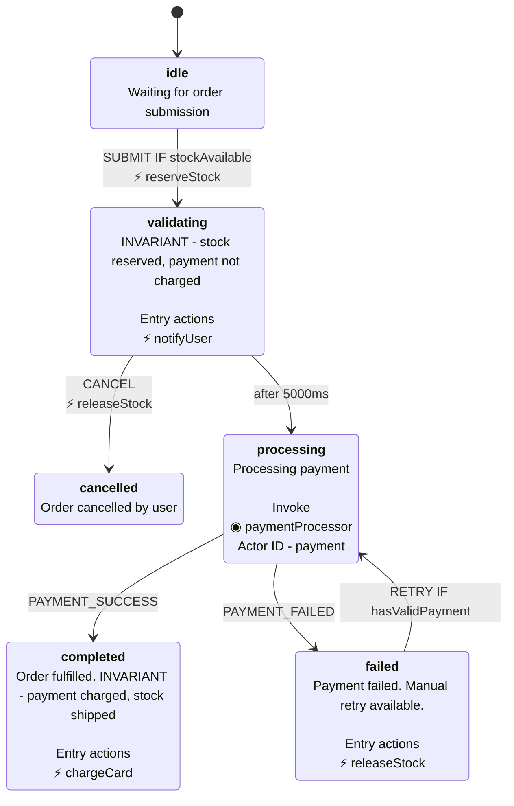

# xstate-ts-to-mermaid

Convert XState v5 TypeScript state machines to Mermaid stateDiagram-v2 format with Stately.ai visual parity.

## Why?

XState v5 has no built-in Mermaid export. The official recommendation from David Piano is to use `@xstate/graph`'s `toDirectedGraph()` and write your own converter. This is that converter.

## Installation

```bash
npm install xstate-ts-to-mermaid
```

## Usage

```typescript
import { setup } from "xstate";
import { toMermaid } from "xstate-ts-to-mermaid";

// Comprehensive example showing ALL supported XState fields
const orderMachine = setup({
  types: {
    events: {} as
      | { type: "SUBMIT" }
      | { type: "CANCEL" }
      | { type: "PAYMENT_SUCCESS" }
      | { type: "PAYMENT_FAILED" }
      | { type: "RETRY" },
  },
  guards: {
    hasValidPayment: () => true,
    stockAvailable: () => true,
  },
  actions: {
    notifyUser: () => {},
    reserveStock: () => {},
    chargeCard: () => {},
    releaseStock: () => {},
  },
  actors: {
    paymentProcessor: {} as any,
  },
}).createMachine({
  id: "order",
  initial: "idle",
  states: {
    idle: {
      description: "Waiting for order submission",
      on: {
        SUBMIT: {
          target: "validating",
          guard: { type: "stockAvailable" },
          actions: [{ type: "reserveStock" }],
        },
      },
    },
    validating: {
      description: "INVARIANT: stock reserved, payment not charged",
      entry: [{ type: "notifyUser" }],
      on: {
        CANCEL: { target: "cancelled", actions: [{ type: "releaseStock" }] },
      },
      after: {
        5000: { target: "processing" },
      },
    },
    processing: {
      description: "Processing payment",
      invoke: [{ src: "paymentProcessor", id: "payment" }],
      on: {
        PAYMENT_SUCCESS: { target: "completed" },
        PAYMENT_FAILED: { target: "failed" },
      },
    },
    completed: {
      description: "Order fulfilled. INVARIANT: payment charged, stock shipped",
      entry: [{ type: "chargeCard" }],
    },
    failed: {
      description: "Payment failed. Manual retry available.",
      entry: [{ type: "releaseStock" }],
      on: {
        RETRY: {
          target: "processing",
          guard: { type: "hasValidPayment" },
        },
      },
    },
    cancelled: {
      description: "Order cancelled by user",
    },
  },
});

console.log(toMermaid(orderMachine, { title: "Order Processing" }));
```

Output (actual generated output, not manually written):



Here is the stately.ai web render for the same Typescript Source of Truth (sorry for light mode):


## Stately.ai Visual Parity

This library aims to match Stately.ai's visual formatting:

- **Bold state headers**: `<b>idle</b>` renders state name prominently
- **Line breaks**: `<br/>` separates header, description, and metadata
- **Entry actions with ⚡**: `Entry actions` section with lightning emoji
- **Invoke actors with ◉**: `Invoke` section with actor details
- **Guards with IF**: `SUBMIT IF stockAvailable` (Stately.ai format)
- **Transition actions with ⚡**: Actions on separate line with emoji
- **Timeout transitions**: `after 5000ms` (raw milliseconds)

## API

### `toMermaid(machine, options?)`

Flat diagram - all states at same level. Good for overview.

### `toMermaidNested(machine, options?)`

Preserves hierarchy using Mermaid's `state {}` syntax for compound states.

### Options

```typescript
interface MermaidOptions {
  title?: string;
  maxDescriptionLength?: number; // 0 = no limit (default)
  includeGuards?: boolean; // Show guards on transitions (default: true)
  includeActions?: boolean; // Show transition actions (default: true)
  includeEntryActions?: boolean; // Show entry actions on states (default: true)
  includeInvokes?: boolean; // Show invoke actors on states (default: true)
}
```

### Exported Helpers

```typescript
import {
  getStateName,
  formatEventName,
  getDescription,
  getEntryActions,
  getInvokes,
  formatTransitionLabel,
} from "xstate-ts-to-mermaid";

getStateName("machine.parent.child"); // "child"
formatEventName("xstate.after.60000.machine..."); // "after 60000ms"
```

## Features

- XState v5 TypeScript compatible
- **Stately.ai visual parity** - matches the official editor's formatting
- Bold state name headers with `<b>` tags
- Proper line breaks with `<br/>` (not literal `\n`)
- Entry actions section with ⚡ emoji
- Invoke section with ◉ and actor details
- Guards displayed as `IF guardName`
- Transition actions with ⚡ emoji on separate line
- Handles nested/compound states
- Formats timeout events with raw milliseconds
- Zero information loss - all metadata from XState is preserved

## License

MIT
