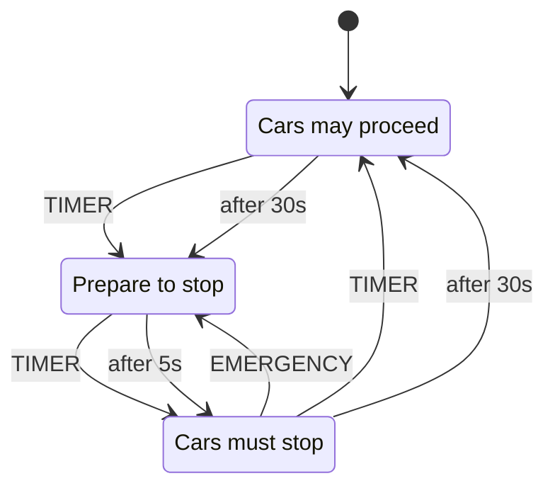

# xstate-ts-to-mermaid

Convert XState v5 TypeScript state machines to Mermaid stateDiagram-v2 format.

## Why?

XState v5 has no built-in Mermaid export. The official recommendation from David Piano is to use `@xstate/graph`'s `toDirectedGraph()` and write your own converter. This is that converter.

## Installation

```bash
npm install xstate-ts-to-mermaid
```

## Usage

```typescript
import { setup } from "xstate";
import { toMermaid } from "xstate-ts-to-mermaid";

const trafficLightMachine = setup({
  types: {
    events: {} as { type: "TIMER" } | { type: "EMERGENCY" },
  },
}).createMachine({
  id: "trafficLight",
  initial: "green",
  states: {
    green: {
      description: "Cars may proceed",
      on: { TIMER: "yellow" },
      after: { 30000: "yellow" },
    },
    yellow: {
      description: "Prepare to stop",
      on: { TIMER: "red" },
      after: { 5000: "red" },
    },
    red: {
      description: "Cars must stop",
      on: { TIMER: "green", EMERGENCY: "yellow" },
      after: { 30000: "green" },
    },
  },
});

console.log(toMermaid(trafficLightMachine, { title: "Traffic Light" }));
```

Output:



## API

### `toMermaid(machine, options?)`

Flat diagram - all states at same level. Good for overview.

### `toMermaidNested(machine, options?)`

Preserves hierarchy using Mermaid's `state {}` syntax for compound states.

### Options

```typescript
interface MermaidOptions {
  title?: string;
  maxDescriptionLength?: number; // 0 = no limit (default)
  includeGuards?: boolean; // Show guards on transitions (default: true)
  includeActions?: boolean; // Show transition actions (default: true)
  includeEntryActions?: boolean; // Show entry actions on states (default: true)
  includeInvokes?: boolean; // Show invoke actors on states (default: true)
}
```

### Exported Helpers

```typescript
import {
  getStateName,
  formatEventName,
  getDescription,
  getEntryActions,
  getInvokes,
  formatTransitionLabel,
} from "xstate-ts-to-mermaid";

getStateName("machine.parent.child"); // "child"
formatEventName("xstate.after.60000.machine..."); // "after 60s"
```

## Features

- XState v5 TypeScript compatible
- Preserves state descriptions as labels
- **Guards**: Shows guards on transitions as `event [guardName]`
- **Transition actions**: Shows actions as `event / action1, action2`
- **Entry actions**: Shows entry actions as `state: entry: action1, action2`
- **Invoke actors**: Shows invoked actors as `state: invoke: machine(id)`
- Handles nested/compound states
- Formats timeout events (`xstate.after.60000...` -> `after 60s`)
- Extracts clean state names from dotted paths
- Zero information loss - all metadata from XState is preserved

## License

MIT
