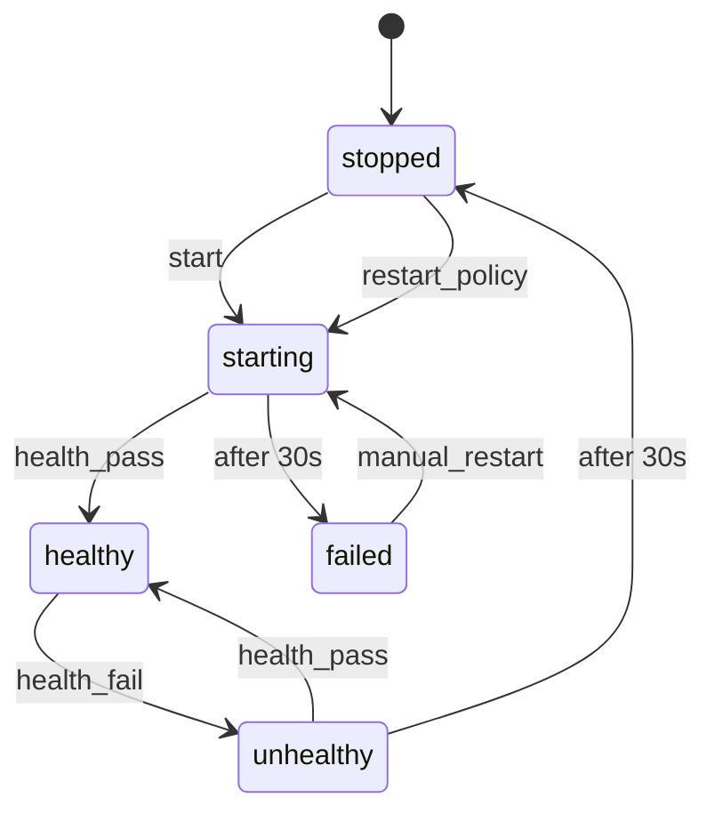

# xstate-to-mermaid

Convert XState v5 TypeScript state machines to Mermaid stateDiagram-v2 format.

## Why?

XState v5 has no built-in Mermaid export. The official recommendation from David Piano is to use `@xstate/graph`'s `toDirectedGraph()` and write your own converter. This is that converter.

## Installation

```bash
npm install xstate-to-mermaid
```

## Usage

```typescript
import { setup } from "xstate";
import { toMermaid } from "xstate-to-mermaid";

const containerMachine = setup({
  types: {
    events: {} as
      | { type: "start" }
      | { type: "restart_policy" }
      | { type: "health_pass" }
      | { type: "health_fail" }
      | { type: "manual_restart" },
  },
}).createMachine({
  id: "container",
  initial: "stopped",
  states: {
    stopped: {
      on: {
        start: { target: "starting" },
        restart_policy: { target: "starting" },
      },
    },
    starting: {
      on: { health_pass: { target: "healthy" } },
      after: { 30000: { target: "failed" } },
    },
    healthy: {
      on: { health_fail: { target: "unhealthy" } },
    },
    unhealthy: {
      on: { health_pass: { target: "healthy" } },
      after: { 30000: { target: "stopped" } },
    },
    failed: {
      on: { manual_restart: { target: "starting" } },
    },
  },
});

console.log(toMermaid(containerMachine, { title: "Container Actor" }));
```

Output:



## API

### `toMermaid(machine, options?)`

Produces a flat diagram with all states at the same level. Good for overview.

### `toMermaidNested(machine, options?)`

Preserves hierarchy using Mermaid's `state {}` syntax for compound states.

### Options

```typescript
interface MermaidOptions {
  title?: string; // Comment at top of diagram
}
```

## Features

- XState v5 TypeScript compatible
- Handles nested/compound states
- Formats timeout events (`xstate.after.60000...` -> `after 60s`)
- Extracts clean state names from dotted paths

## Tested With

- XState v5
- @xstate/graph v3
- Manually verified output renders correctly in GitHub markdown and Mermaid Live Editor

## License

MIT
