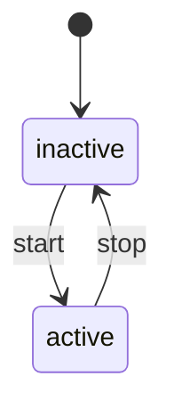

# xstate-to-mermaid

Convert XState v5 state machines to Mermaid stateDiagram-v2 format.

## Why?

XState v5 has no built-in Mermaid export. The official recommendation from David Piano is to use `@xstate/graph`'s `toDirectedGraph()` and write your own converter. This is that converter.

## Installation

```bash
npm install xstate-to-mermaid
```

## Usage

```typescript
import { setup } from "xstate";
import { toMermaid } from "xstate-to-mermaid";

const machine = setup({
  types: {
    events: {} as { type: "start" } | { type: "stop" },
  },
}).createMachine({
  id: "toggle",
  initial: "inactive",
  states: {
    inactive: {
      on: { start: "active" },
    },
    active: {
      on: { stop: "inactive" },
    },
  },
});

console.log(toMermaid(machine, { title: "Toggle Machine" }));
```

Output:



## API

### `toMermaid(machine, options?)`

Produces a flat diagram with all states at the same level. Good for overview.

### `toMermaidNested(machine, options?)`

Preserves hierarchy using Mermaid's `state {}` syntax for compound states.

### Options

```typescript
interface MermaidOptions {
  title?: string; // Comment at top of diagram
}
```

## Features

- XState v5 compatible
- Handles nested/compound states
- Formats timeout events (`xstate.after.60000...` -> `after 60s`)
- Extracts clean state names from dotted paths

## Tested With

- XState v5
- @xstate/graph v3
- Manually verified output renders correctly in GitHub markdown and Mermaid Live Editor

## License

MIT
