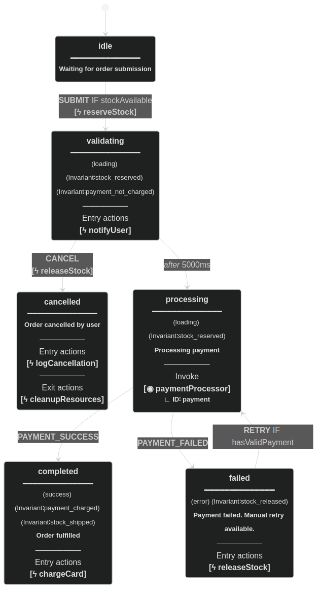
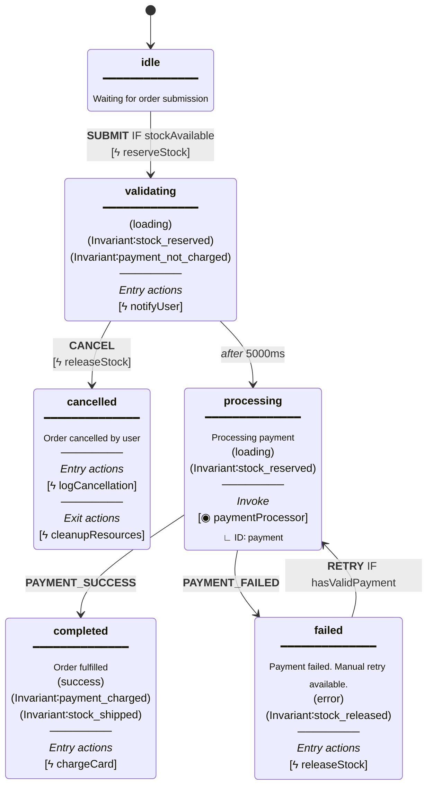

# xstate-ts-to-mermaid

Convert XState v5 TypeScript state machines to Mermaid stateDiagram-v2 format with Stately.ai visual parity.

## Visual Parity with Stately.ai

| Stately.ai Editor (Reference) | This Library (Mermaid Output) |
|:-----------------------------:|:-----------------------------:|
|  |  |

**Legend:**

| Symbol | Meaning |
|:------:|---------|
| **bold** | State name (lowercase), Event names |
| `━━━━━━` | Header separator line |
| `<sub>` | Description & Actor ID (smaller text) |
| *italic* | Section labels, *after* keyword |
| `(tag)` | Tags (styled as pills in Stately.ai) |
| `[ϟ action]` | Action with lightning inside brackets |
| `[◉ actor]` | Invoked actor in brackets |
| `∟` | Corner symbol for nested info |
| `IF` | Guard condition on transition |
| `────────` | Section separator |

## Why?

XState v5 has no built-in Mermaid export. The official recommendation from David Piano is to use `@xstate/graph`'s `toDirectedGraph()` and write your own converter. This library provides visual parity with Stately.ai's editor, unlike the simplified Mermaid export Stately.ai currently provides.

## Installation

```bash
npm install xstate-ts-to-mermaid
```

## Usage

### Machine Definition (Source of Truth)

See [`examples/order-machine.ts`](examples/order-machine.ts) for a complete example demonstrating ALL supported XState v5 fields. This file is the single source of truth - tests verify both the machine and documentation against it.

### Generated Output

Output (actual generated output, not manually written):



## Supported XState Fields

| Field | Description | Rendering |
|-------|-------------|-----------|
| `description` | State description | Plain text below state name |
| `tags` | Array of string tags | `(tag)` with `INV:` expanded to `Invariant∶` |
| `meta` | Generic metadata object | `*key* - value` (italicized keys) |
| `entry` | Entry actions array | Section with `ϟ actionName` |
| `exit` | Exit actions array | Section with `ϟ actionName` |
| `invoke` | Invoked actors | Section with `◉ actorSrc` and `Actor ID∶ id` |
| `on` | Event transitions | `EVENT IF guard` on edges |
| `after` | Delayed transitions | `after Xms` on edges |

## API

### `toMermaid(machine, options?)`

Flat diagram - all states at same level. Good for overview.

### `toMermaidNested(machine, options?)`

Preserves hierarchy using Mermaid's `state {}` syntax for compound states.

### Options

```typescript
interface MermaidOptions {
  title?: string;
  maxDescriptionLength?: number; // 0 = no limit (default)
  includeGuards?: boolean;       // default: true
  includeActions?: boolean;      // default: true
  includeEntryActions?: boolean; // default: true
  includeExitActions?: boolean;  // default: true
  includeInvokes?: boolean;      // default: true
  includeTags?: boolean;         // default: true
  includeMeta?: boolean;         // default: true
}
```

### Exported Helpers

```typescript
import {
  getStateName,
  formatEventName,
  getDescription,
  getEntryActions,
  getExitActions,
  getInvokes,
  getTags,
  getMeta,
  formatTransitionLabel,
} from "xstate-ts-to-mermaid";

getStateName("machine.parent.child"); // "child"
formatEventName("xstate.after.60000.machine..."); // "after 60000ms"
```

## Important: `meta` vs `tags`

**Warning:** The `meta` field is valid XState v5, but **Stately.ai's visual editor has no UI for it**. When you import a machine with `meta` into Stately.ai and export it, the `meta` field gets cleansed/dropped.

**Recommendation:** Use `tags` instead of `meta` - tags survive Stately.ai round-trips.

## Development

```bash
npm test           # Run all tests
npm run build      # Build library
```

### Project Structure

```
├── index.ts                    # Library source
├── examples/
│   └── order-machine.ts        # Example machine (source of truth)
├── tests/
│   ├── field-coverage.test.ts  # Verifies all XState fields render
│   └── readme-sync.test.ts     # Verifies README matches output
└── .github/
    ├── assets/                 # Generated comparison images
    └── workflows/ci.yml        # CI pipeline
```

## License

MIT
