# xstate-ts-to-mermaid

Convert XState v5 TypeScript state machines to Mermaid stateDiagram-v2 format with Stately.ai visual parity.

## Why?

XState v5 has no built-in Mermaid export. The official recommendation from David Piano is to use `@xstate/graph`'s `toDirectedGraph()` and write your own converter. This is that converter.

## Installation

```bash
npm install xstate-ts-to-mermaid
```

## Usage

```typescript
import { setup } from "xstate";
import { toMermaid } from "xstate-ts-to-mermaid";

// Comprehensive example showing ALL supported XState fields including meta.invariants
const orderMachine = setup({
  types: {
    events: {} as
      | { type: "SUBMIT" }
      | { type: "CANCEL" }
      | { type: "PAYMENT_SUCCESS" }
      | { type: "PAYMENT_FAILED" }
      | { type: "RETRY" },
  },
  guards: {
    hasValidPayment: () => true,
    stockAvailable: () => true,
  },
  actions: {
    notifyUser: () => {},
    reserveStock: () => {},
    chargeCard: () => {},
    releaseStock: () => {},
  },
  actors: {
    paymentProcessor: {} as any,
  },
}).createMachine({
  id: "order",
  initial: "idle",
  states: {
    idle: {
      description: "Waiting for order submission",
      on: {
        SUBMIT: {
          target: "validating",
          guard: { type: "stockAvailable" },
          actions: [{ type: "reserveStock" }],
        },
      },
    },
    validating: {
      meta: {
        invariants: ["stock_reserved", "payment_not_charged"],
      },
      entry: [{ type: "notifyUser" }],
      on: {
        CANCEL: { target: "cancelled", actions: [{ type: "releaseStock" }] },
      },
      after: {
        5000: { target: "processing" },
      },
    },
    processing: {
      description: "Processing payment",
      invoke: [{ src: "paymentProcessor", id: "payment" }],
      on: {
        PAYMENT_SUCCESS: { target: "completed" },
        PAYMENT_FAILED: { target: "failed" },
      },
    },
    completed: {
      description: "Order fulfilled",
      meta: {
        invariants: ["payment_charged", "stock_shipped"],
      },
      entry: [{ type: "chargeCard" }],
    },
    failed: {
      description: "Payment failed. Manual retry available.",
      entry: [{ type: "releaseStock" }],
      on: {
        RETRY: {
          target: "processing",
          guard: { type: "hasValidPayment" },
        },
      },
    },
    cancelled: {
      description: "Order cancelled by user",
    },
  },
});

console.log(toMermaid(orderMachine, { title: "Order Processing" }));
```

Output (actual generated output, not manually written):

```mermaid
stateDiagram-v2
    %% Order Processing
    [*] --> idle
    idle: <b>idle</b><br/>Waiting for order submission
    idle --> validating: SUBMIT IF stockAvailable<br/>⚡ reserveStock
    validating: <b>validating</b><br/>🔒 stock_reserved<br/>🔒 payment_not_charged<br/><i>Entry actions</i><br/>⚡ notifyUser
    validating --> cancelled: CANCEL<br/>⚡ releaseStock
    validating --> processing: after 5000ms
    processing: <b>processing</b><br/>Processing payment<br/><i>Invoke</i><br/>◉ paymentProcessor<br/>Actor ID - payment
    processing --> completed: PAYMENT_SUCCESS
    processing --> failed: PAYMENT_FAILED
    completed: <b>completed</b><br/>Order fulfilled<br/>🔒 payment_charged<br/>🔒 stock_shipped<br/><i>Entry actions</i><br/>⚡ chargeCard
    failed: <b>failed</b><br/>Payment failed. Manual retry available.<br/><i>Entry actions</i><br/>⚡ releaseStock
    failed --> processing: RETRY IF hasValidPayment
    cancelled: <b>cancelled</b><br/>Order cancelled by user
```



Here is the stately.ai web render for the same Typescript Source of Truth and UX parity check:


## Stately.ai Visual Parity

This library aims to match Stately.ai's visual formatting:

- **`<b>` Bold state headers**: State name rendered prominently
- **`<br/>` Line breaks**: Proper separation between elements
- **`<i>` Italic subheadings**: "Entry actions" and "Invoke" labels
- **🔒 Invariants**: `meta.invariants` rendered with lock emoji
- **⚡ Actions**: Entry and transition actions with lightning emoji
- **◉ Invoke actors**: Actor source and ID
- **IF guards**: `SUBMIT IF stockAvailable` format

## Invariants via `meta.invariants`

XState doesn't have a built-in invariant field. Use `meta.invariants` array:

```typescript
states: {
  healthy: {
    meta: {
      invariants: ["all_containers_running", "memory_writable"],
    },
    description: "System operational",
  },
}
```

Renders as:
```
🔒 all_containers_running
🔒 memory_writable
```

## API

### `toMermaid(machine, options?)`

Flat diagram - all states at same level. Good for overview.

### `toMermaidNested(machine, options?)`

Preserves hierarchy using Mermaid's `state {}` syntax for compound states.

### Options

```typescript
interface MermaidOptions {
  title?: string;
  maxDescriptionLength?: number; // 0 = no limit (default)
  includeGuards?: boolean; // Show guards on transitions (default: true)
  includeActions?: boolean; // Show transition actions (default: true)
  includeEntryActions?: boolean; // Show entry actions on states (default: true)
  includeInvokes?: boolean; // Show invoke actors on states (default: true)
  includeInvariants?: boolean; // Show meta.invariants on states (default: true)
}
```

### Exported Helpers

```typescript
import {
  getStateName,
  formatEventName,
  getDescription,
  getEntryActions,
  getInvokes,
  getInvariants,
  formatTransitionLabel,
} from "xstate-ts-to-mermaid";

getStateName("machine.parent.child"); // "child"
formatEventName("xstate.after.60000.machine..."); // "after 60000ms"
```

## Features

- XState v5 TypeScript compatible
- **Stately.ai visual parity** - matches the official editor's formatting
- `<b>` bold state name headers
- `<i>` italic section labels (Entry actions, Invoke)
- `<br/>` proper line breaks
- 🔒 `meta.invariants` support with lock emoji
- ⚡ entry and transition actions with lightning emoji
- ◉ invoke actors with source and ID
- IF format for guards
- Handles nested/compound states
- Formats timeout events with raw milliseconds
- Zero information loss - all metadata from XState is preserved

## License

MIT
