# xstate-ts-to-mermaid

Convert XState v5 TypeScript state machines to Mermaid stateDiagram-v2 format with Stately.ai visual parity.

## Why?

XState v5 has no built-in Mermaid export. The official recommendation from David Piano is to use `@xstate/graph`'s `toDirectedGraph()` and write your own converter. This is that converter.

## Installation

```bash
npm install xstate-ts-to-mermaid
```

## Usage

```typescript
import { setup } from "xstate";
import { toMermaid } from "xstate-ts-to-mermaid";

// Example using official XState v5 fields: description, tags, entry, invoke
const orderMachine = setup({
  types: {
    events: {} as
      | { type: "SUBMIT" }
      | { type: "CANCEL" }
      | { type: "PAYMENT_SUCCESS" }
      | { type: "PAYMENT_FAILED" }
      | { type: "RETRY" },
    tags: {} as "loading" | "error" | "success",
  },
  guards: {
    hasValidPayment: () => true,
    stockAvailable: () => true,
  },
  actions: {
    notifyUser: () => {},
    reserveStock: () => {},
    chargeCard: () => {},
    releaseStock: () => {},
  },
  actors: {
    paymentProcessor: {} as any,
  },
}).createMachine({
  id: "order",
  initial: "idle",
  states: {
    idle: {
      description: "Waiting for order submission",
      on: {
        SUBMIT: {
          target: "validating",
          guard: { type: "stockAvailable" },
          actions: [{ type: "reserveStock" }],
        },
      },
    },
    validating: {
      tags: ["loading"],
      entry: [{ type: "notifyUser" }],
      on: {
        CANCEL: { target: "cancelled", actions: [{ type: "releaseStock" }] },
      },
      after: {
        5000: { target: "processing" },
      },
    },
    processing: {
      tags: ["loading"],
      description: "Processing payment",
      invoke: [{ src: "paymentProcessor", id: "payment" }],
      on: {
        PAYMENT_SUCCESS: { target: "completed" },
        PAYMENT_FAILED: { target: "failed" },
      },
    },
    completed: {
      tags: ["success"],
      description: "Order fulfilled",
      entry: [{ type: "chargeCard" }],
    },
    failed: {
      tags: ["error"],
      description: "Payment failed. Manual retry available.",
      entry: [{ type: "releaseStock" }],
      on: {
        RETRY: {
          target: "processing",
          guard: { type: "hasValidPayment" },
        },
      },
    },
    cancelled: {
      description: "Order cancelled by user",
    },
  },
});

console.log(toMermaid(orderMachine, { title: "Order Processing" }));
```

Output (actual generated output, not manually written):

```mermaid
stateDiagram-v2
    %% Order Processing
    [*] --> idle
    idle: <b>idle</b><br/>Waiting for order submission
    idle --> validating: SUBMIT IF stockAvailable<br/>⚡ reserveStock
    validating: <b>validating</b><br/>🏷️ loading<br/>───────────<br/><b><i>Entry actions</i></b><br/>⚡ notifyUser
    validating --> cancelled: CANCEL<br/>⚡ releaseStock
    validating --> processing: after 5000ms
    processing: <b>processing</b><br/>Processing payment<br/>🏷️ loading<br/>───────────<br/><b><i>Invoke</i></b><br/>◉ paymentProcessor<br/>Actor ID - payment
    processing --> completed: PAYMENT_SUCCESS
    processing --> failed: PAYMENT_FAILED
    completed: <b>completed</b><br/>Order fulfilled<br/>🏷️ success<br/>───────────<br/><b><i>Entry actions</i></b><br/>⚡ chargeCard
    failed: <b>failed</b><br/>Payment failed. Manual retry available.<br/>🏷️ error<br/>───────────<br/><b><i>Entry actions</i></b><br/>⚡ releaseStock
    failed --> processing: RETRY IF hasValidPayment
    cancelled: <b>cancelled</b><br/>Order cancelled by user
```



## Stately.ai Visual Parity

This library renders all official XState v5 state node fields:

- **`description`** - State description text
- **`tags`** - Array of tags with 🏷️ prefix
- **`meta`** - Generic key-value metadata (rendered as `key - value`)
- **`entry`** - Entry actions with ⚡ prefix
- **`invoke`** - Invoked actors with ◉ prefix
- **`on`** / **`after`** / **`always`** - Transitions with guards (IF format)

Visual formatting:
- **`<b>` Bold state headers**: State name rendered prominently
- **`<br/>` Line breaks**: Proper separation between elements
- **`───────────` Horizontal separators**: Visual distinction between content and action sections
- **`<b><i>` Bold+italic section headers**: "Entry actions" and "Invoke" labels stand out clearly

## Supported XState Fields

| Field | Description | Rendering |
|-------|-------------|-----------|
| `description` | State description | Plain text below state name |
| `tags` | Array of string tags | `🏷️ tag1, tag2` |
| `meta` | Generic metadata object | Each key-value as `key - value` |
| `entry` | Entry actions array | Section with `⚡ actionName` |
| `invoke` | Invoked actors | Section with `◉ actorSrc` and `Actor ID - id` |
| `on` | Event transitions | `EVENT IF guard` on edges |
| `after` | Delayed transitions | `after Xms` on edges |

## API

### `toMermaid(machine, options?)`

Flat diagram - all states at same level. Good for overview.

### `toMermaidNested(machine, options?)`

Preserves hierarchy using Mermaid's `state {}` syntax for compound states.

### Options

```typescript
interface MermaidOptions {
  title?: string;
  maxDescriptionLength?: number; // 0 = no limit (default)
  includeGuards?: boolean; // Show guards on transitions (default: true)
  includeActions?: boolean; // Show transition actions (default: true)
  includeEntryActions?: boolean; // Show entry actions on states (default: true)
  includeInvokes?: boolean; // Show invoke actors on states (default: true)
  includeTags?: boolean; // Show tags on states (default: true)
  includeMeta?: boolean; // Show meta on states (default: true)
}
```

### Exported Helpers

```typescript
import {
  getStateName,
  formatEventName,
  getDescription,
  getEntryActions,
  getInvokes,
  getTags,
  getMeta,
  formatTransitionLabel,
} from "xstate-ts-to-mermaid";

getStateName("machine.parent.child"); // "child"
formatEventName("xstate.after.60000.machine..."); // "after 60000ms"
```

## Features

- XState v5 TypeScript compatible
- **Stately.ai visual parity** - renders all official XState state node fields
- `<b>` bold state name headers
- `<b><i>` bold+italic section headers (Entry actions, Invoke)
- `───────────` horizontal separators for visual distinction
- `<br/>` proper line breaks
- 🏷️ tags support
- `meta` rendered as key-value pairs
- ⚡ entry and transition actions
- ◉ invoke actors with source and ID
- IF format for guards
- Handles nested/compound states
- Formats timeout events with raw milliseconds
- Zero information loss - all metadata from XState is preserved

## License

MIT
